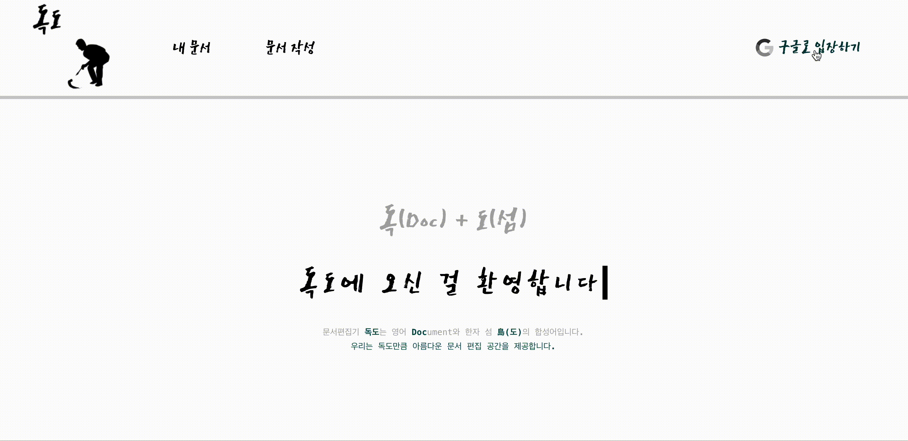
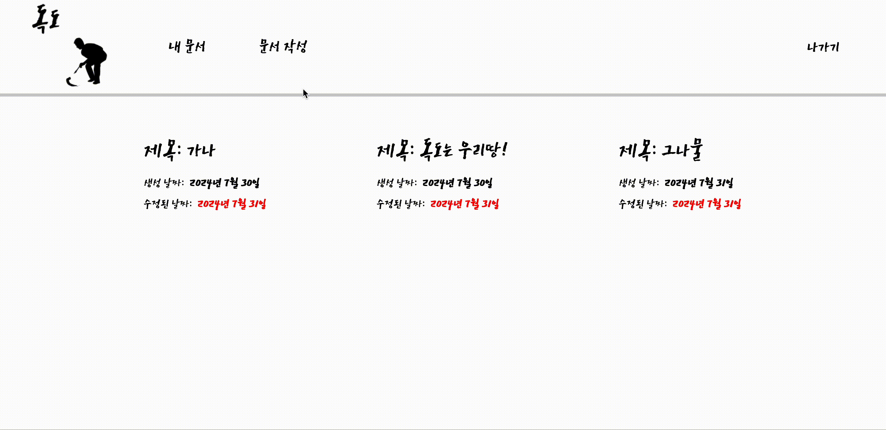
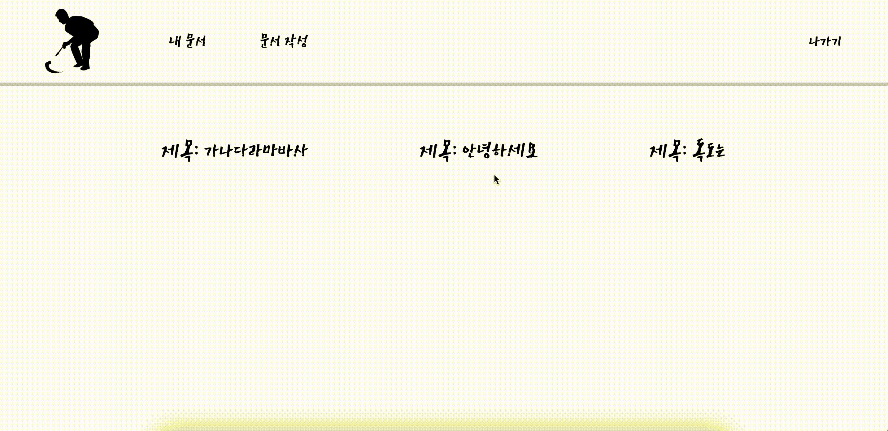
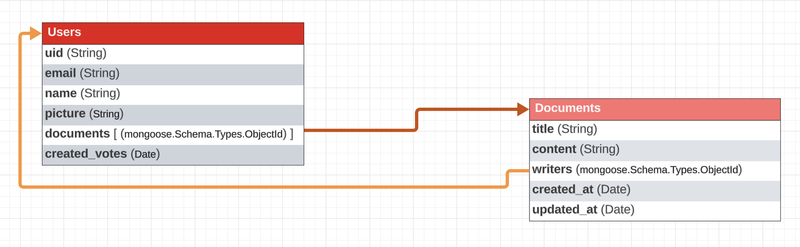

> Mongo DB를 활용한 문서 편집 공유 서비스입니다.


### **Docdo**
> 문서(Doc)와 섬(do)의 합성어로 독도만큼 아름다운 문서 편집 공간입니다.

[Firebase 배포](https://docs-e30a1.web.app) (데이터베이스 연결X)

| 로그인 (Google) | 문서 생성 |
|-----------|-----------|
|  |  | 

| 문서 수정 | 문서 삭제 | 
|-----------|-----------|
|  |  | 
<br>

## 🗂️ Project Structure
### Backend
- `controllers`: 프로젝트의 요청 로직을 처리하는 함수
- `database`: MongoDB에 연결을 설정하는 파일
- `models`: 컨트롤러와 데이터베이스 사이에서 데이터의 유효성을 검사하는 함수 (스키마 정의)
- `middleware`: 요청과 응답 사이에 인증 및 초기화를 담당하는 함수
- `public`: 정적인 CSS, JavaScript, 이미지 파일
- `routes`: HTTP 메서드를 사용한 앱 경로 지정 핸들러 파일
- `app.js`: 해당 프로젝트 루트 파일

### Frontend
- `components`: 프로젝트에서 공통으로 사용되는 컴포넌트
- `pages`: 프로젝트에서 사용되는 페이지
- `services`: 데이터를 받아오는 api 관련 로직
- `styles`: 전역 스타일 코드 파일들
- `App.jsx`: 해당 프로젝트 루트 파일

```
📝Docdo
┣ 🗂️backend
┃ ┣ 📂bin
┃ ┃ ┗ www
┃ ┣ 📂controller
┃ ┃ ┣ documentController.js
┃ ┃ ┗ jwtController.js
┃ ┣ 📂database
┃ ┃ ┗ connection.js
┃ ┣ 📂middlewares
┃ ┃ ┣ firebaseAdmin.js
┃ ┃ ┗ jwtAuth.js
┃ ┣ 📂models
┃ ┃ ┣ Document.js
┃ ┃ ┗ User.js
┃ ┣ 📂routes
┃ ┃ ┣ auth.js
┃ ┃ ┗ documents.js
┃ ┣ package.json
┃ ┣ package-lock.json
┃ ┣ Procfile
┃ ┗ app.js
┣ 🗂️frontend
┃ ┣ 📂public
┃ ┃ ┗ index.html
┃ ┣ 📂src
┃ ┃ ┣ 📂components
┃ ┃ ┃ ┣ Document.jsx
┃ ┃ ┃ ┣ DocumentStyle.jsx
┃ ┃ ┃ ┣ Navigation.jsx
┃ ┃ ┃ ┣ NavigationStyle.jsx
┃ ┃ ┃ ┣ UserLogin.jsx
┃ ┃ ┃ ┗ UserLoginStyle.jsx
┃ ┃ ┣ 📂pages
┃ ┃ ┃ ┣ DocumentCreator.jsx
┃ ┃ ┃ ┣ DocumentCreatorStyle.jsx
┃ ┃ ┃ ┣ DocumentEditor.jsx
┃ ┃ ┃ ┣ DocumentEditorStyle.jsx
┃ ┃ ┃ ┣ DocumentList.jsx
┃ ┃ ┃ ┗ DocumentListStyle.jsx
┃ ┃ ┣ 📂services
┃ ┃ ┃ ┣ documents.js
┃ ┃ ┃ ┗ instance.js
┃ ┃ ┣ 📂styles
┃ ┃ ┃ ┣ GlobalStyle.jsx
┃ ┃ ┃ ┗ Theme.jsx
┃ ┃ ┣ App.jsx
┃ ┃ ┣ index.css
┃ ┃ ┗ index.jsx
┃ ┣ firebase.json
┃ ┣ package.json
┃ ┗ package-lock.json
┗ README.md
```

<br>

## 🗃️ Schema


**화살표는 각 Schema 끼리 참조`ref`하고 있습니다.**

<br>

## ☑️ 남은 할 일

### 1. 문서 작업

- [ ] 문서 제목 중복 유효성 검사
- [ ] 최근 문서 순으로 정렬

### 2. 배포

- [ ] AWS 배포하기
  - 생성한 환경에 데이터가 전달되고 있지 않습니다.
